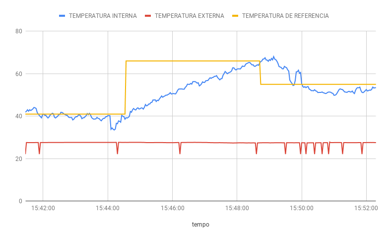
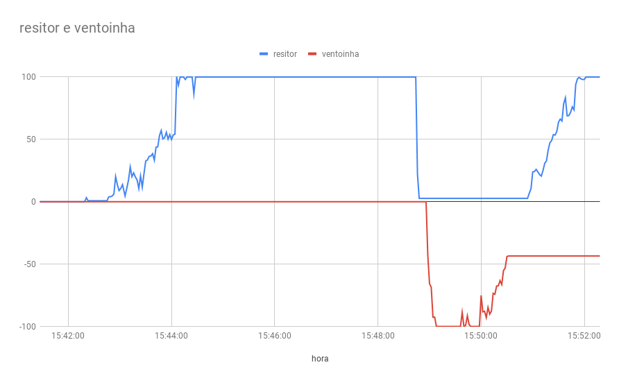

# Projeto 1
Projeto 1 da disciplina de Fundamentos de Sistemas Embarcados (2020/2)

Enunciado do projeto pode ser encontrado em: https://gitlab.com/fse_fga/projetos_2020_2/projeto-1-2020.2

**Nome**: Lucas Alexandre Fernandes Martins

**Matrícula**: 150136862

## Objetivos 

Este trabalho tem por objetivo a implementação do controle de temperatura de um sistema que possui internamente dois dispositivos para alterar sua temperatura. O primeiro é um resistor de potência de 15 Watts utilziado para aumentar temperatura e o segundo, uma ventoinha que puxa o ar externo (à temperatura ambiente) para reduzir a temperatura.
A temperatura de referência (TR) deve poder ser definida pelo usuário do sistema de duas maneiras:

Através de um Potenciômetro;
Através de entrada de teclado no terminal.

O controle de temperatura do sistema deve ser realizado utilizando a abordagem de controle PID (Proporcional Integral Derivativo). O PID é um dos tipos mais simples de algoritmos de controle que proporciona um bom desempenho para uma grande variedade de aplicações.
Neste caso, quando o valor medido de temperatura ficar abaixo do limite inferior, o controlador deverá acionar o resistor de potência para aquecer o sistema. Caso a temperatura medida esteja acima do limite superior, o controlador deve desligar a resistência e acionar a ventoinha.

## Execução
```sh
$ git clone https://github.com/lucasA27/Sistemas-Embarcados
$ cd Projeto1-ControleTemperatura
$ make
$ ./main.o
```

## Resultados

Os gráficos foram gerados através da ferramenta excel da microsoft de um arquivo CSV:

- TEMPERATURAS:


- VENTOINHA E RESISTOR:


