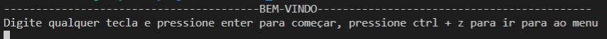
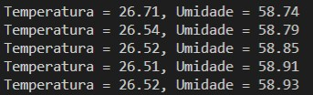
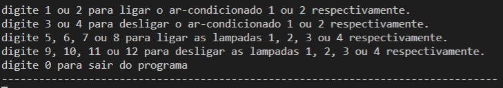

# Projeto 2
Projeto 2 da disciplina de Fundamentos de Sistemas Embarcados (2020/2)

Enunciado do projeto pode ser encontrado em: https://gitlab.com/fse_fga/projetos_2020_2/projeto-2-2020.2

**Nome**: Lucas Alexandre Fernandes Martins

**Matrícula**: 150136862

## Objetivos 

Este trabalho tem por objetivo a criação de um sistema distribuído de automação residencial para monitoramento e acionamento de sensores e dispositivos. O sistema deve ser desenvolvido para funcionar em um conjunto de placas Raspberry Pi com um servidor central responsável pelo controle e interface com o usuário e servidores distribuídos para leitura e acionamento dos dispositivos. Dentre os dispositivos envolvidos estão o monitoramento de temperatura, sensores de presença, sensores de abertura e fechamento de portas e janelas, acionamento de lâmpadas, aparelhos de ar-condicionado e alarme.

## Execução servidor distribuido
```sh
$ git clone https://github.com/lucasA27/Sistemas-Embarcados
$ cd projeto2/servidor_distribuido
$ make
$ ./bin/bin
$ make clean para remover binarios
```

## Execução servidor central
```sh
$ git clone https://github.com/lucasA27/Sistemas-Embarcados
$ cd projeto2/servidor_central
$ make
$ ./bin/bin
$ make clean para remover binarios
```

## Prints da aplicação





